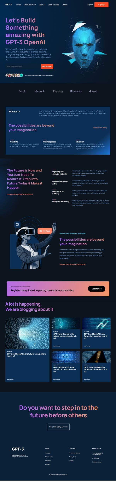

# GPT3  
  
This React project was bootstrapped with [Create React App](https://github.com/facebook/create-react-app).  
The only dependency I installed was react-icons, which was for accessing a navbar for smaller viewports.  
I built it from a tutorial of the YouTube channel -- _JavaScript Mastery_.  
The channel provided about 15 images as assets, imported locally, and a Figma design.  
  
The mock webpage is about GPT-3 OpenAI and registering to explore the possiblities with it.  
It is responsive has an attractive look to it.  
It was made with about a dozen function components.  
  
  
  